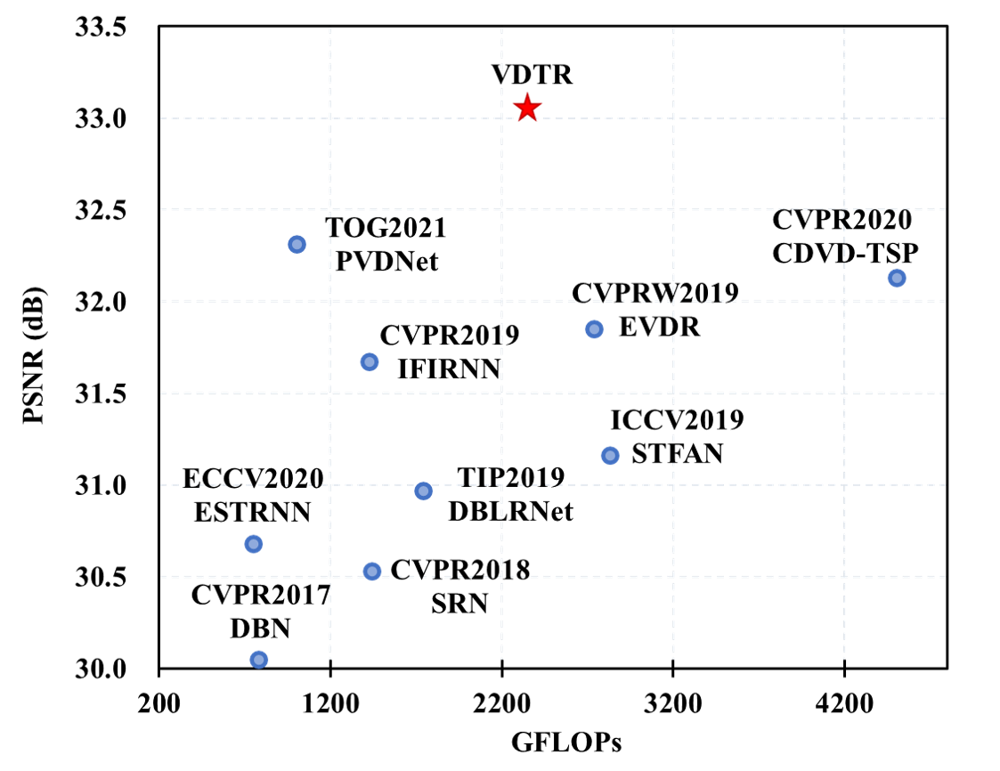
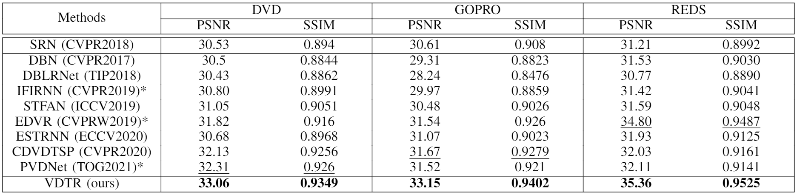
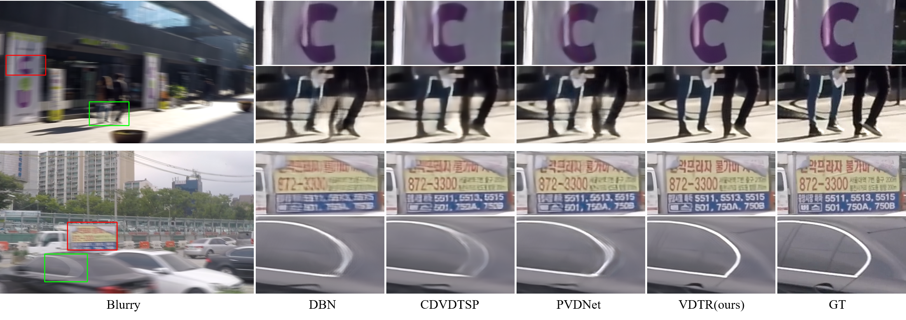

# VDTR: Video Deblurring with Transformer
We propose Video Deblurring Transformer (VDTR), a simple yet effective model that takes advantage of the long-range and relation modeling characteristics of Transformer for video deblurring. VDTR obtained highly competitive performance on the popular video deblurring benchmearks. Code will be public soon. 

 

 

<!--  -->

---
> Spatio-temporal learning is significant for video deblurring, which is dominated by convolution-based methods. This paper presents VDTR, an effective Transformer-based model that makes the first attempt to adapt Transformer for video deblurring. VDTR exploits the superior long-range and relation modeling capabilities of Transformer for both spatial and temporal modeling. However, it is challenging to design an appropriate Transformer-based model for video deblurring due to the high computational costs for high-resolution spatial mooodeling and the misalignment across frames for temporal modeling. 
To address these problems, VDTR advocates performing attention within non-overlapping windows and exploiting the hierarchical structure for long-range dependencies modeling. For frame-level spatial modeling, we propose an encoder-decoder Transformer that utilizes multi-scale features for deblurring. For multi-frame temporal modeling, we adapt Transformer to fuse multiple spatial features efficiently. Compared with CNN-based methods, the proposed method achieves highly competitive results on both synthetic and real-world video deblurring benchmarks, including DVD, GOPRO, REDS and BSD. We hope such a pure Transformer-based architecture can serve as a powerful alternative baseline for video deblurring and other video restoration tasks.

 

Model Architecture

### Experimental Results
**Quantitative results on popular video deblurring datasets: DVD, GOPRO, REDS**

**Qualitative comparison to state-of-the-art video deblurring methods on GOPRO**

### Acknowledgement